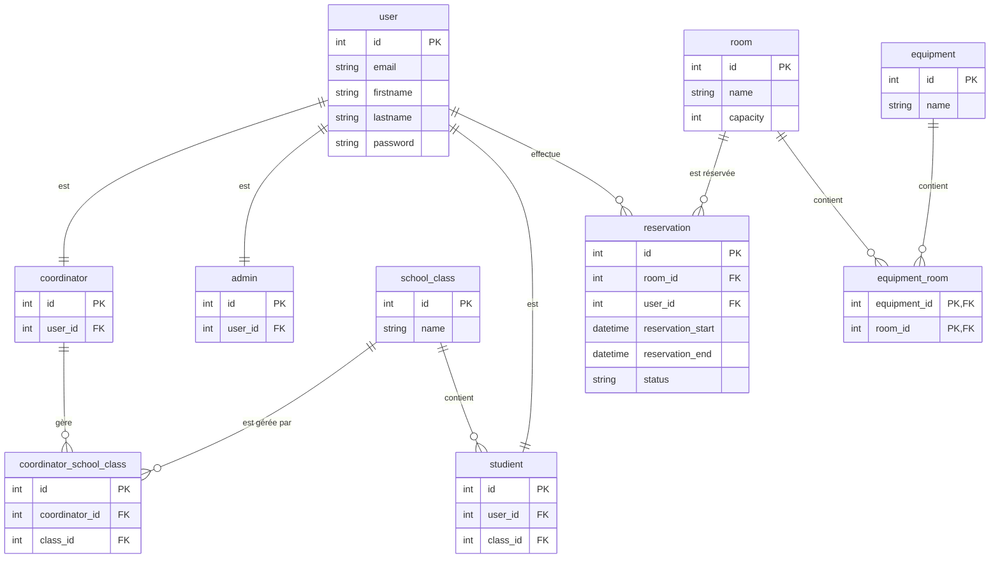
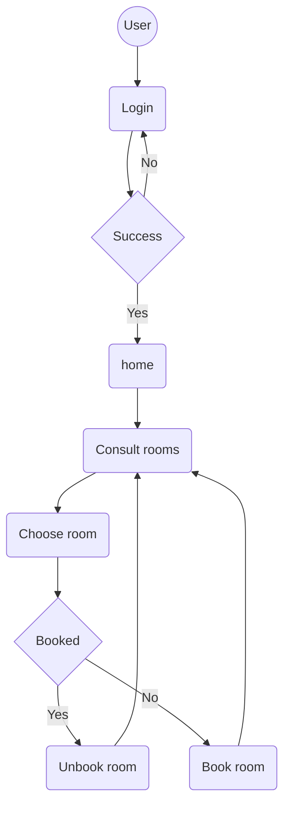
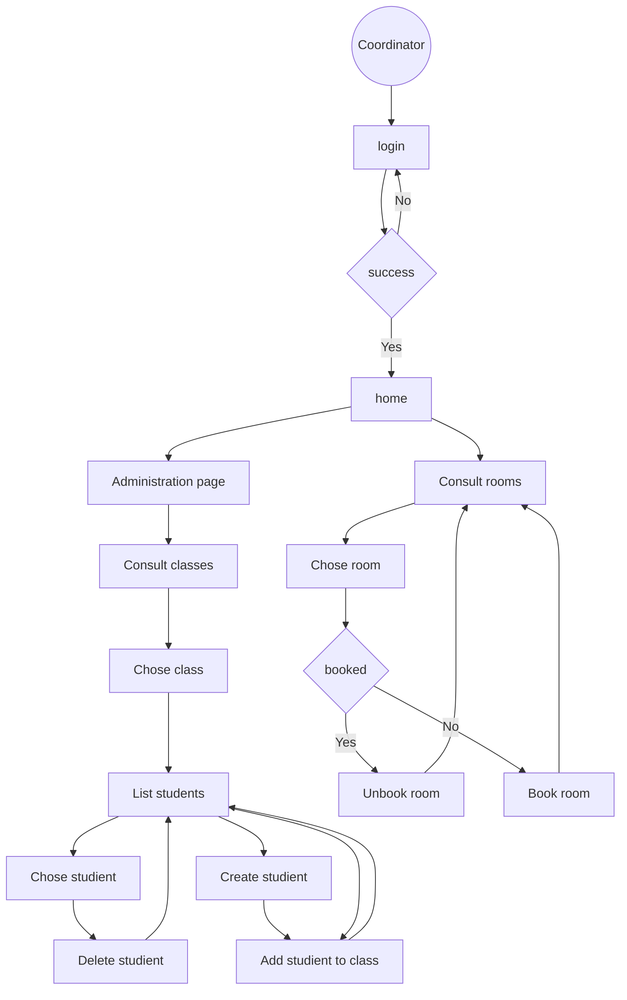
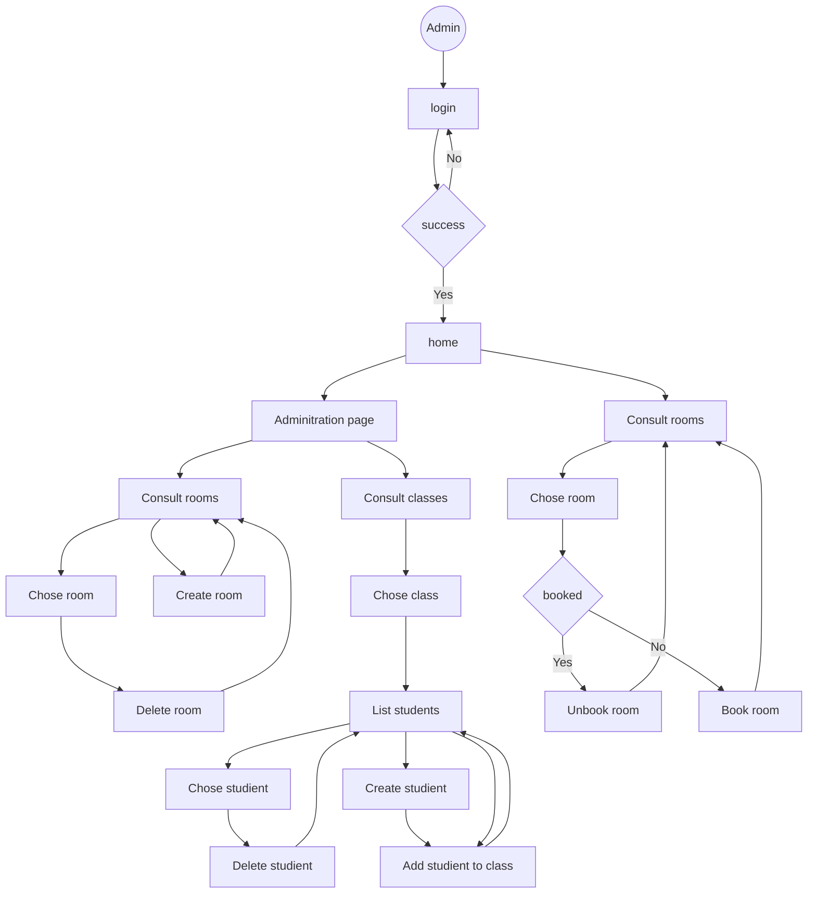

# RoomBoking — Application web de réservation de salles

> **BTS SIO SLAM — Réalisation professionnelle**

---

## Présentation de l'entreprise

L'entreprise fictive dans laquelle s'inscrit cette réalisation est l'établissement scolaire **MediaSchool Nice**, une école privée proposant des formations du type BTS, Bachelor et Master. L'établissement accueille plusieurs centaines d'élèves répartis dans différentes classes, encadrés par des coordinateurs pédagogiques et administrés par une équipe d'administration.

L'activité numérique de l'établissement repose sur :

- la gestion de salles de cours et de leurs équipements,
- le suivi des classes et des étudiants,
- la planification et la réservation de créneaux horaires pour l'utilisation des salles.

---

## Intitulé de la réalisation

Conception et développement d'une application web de gestion et de réservation de salles pour un établissement scolaire, avec gestion des rôles utilisateurs (étudiant, coordinateur, administrateur).

---

## Description

**RoomBoking** est une application web développée avec le framework **Symfony 8** en **PHP 8.4**, permettant à des utilisateurs authentifiés de consulter la disponibilité des salles et d'effectuer des réservations en ligne.

Le projet est conteneurisé via **Docker Compose** (PHP-FPM, Nginx, PostgreSQL), ce qui garantit un environnement reproductible en développement comme en production.

---

## Pour qui ?

L'application cible **trois profils d'utilisateurs** distincts, gérés via un système de rôles :

| Rôle                                  | Accès                                                           |
| ------------------------------------- | --------------------------------------------------------------- |
| **Étudiant** (`ROLE_USER`)            | Consulter et réserver des salles                                |
| **Coordinateur** (`ROLE_COORDINATOR`) | Gérer ses classes, ses étudiants, consulter les réservations    |
| **Administrateur** (`ROLE_ADMIN`)     | Accès complet : salles, équipements, utilisateurs, réservations |

Ces rôles sont définis dans la configuration de sécurité Symfony (`security.yaml`) et appliqués via la méthode `denyAccessUnlessGranted()` dans chaque contrôleur.

---

## Pourquoi ?

### Problématique

L'établissement ne disposait d'aucun outil centralisé pour gérer la disponibilité de ses salles. Les réservations se faisaient oralement ou sur papier, ce qui engendrait :

- des **conflits de créneaux** entre enseignants ou groupes,
- une **absence de visibilité** sur l'occupation des salles en temps réel,
- une **perte de temps** pour les coordinateurs et l'administration,
- aucune **traçabilité** des réservations passées.

### Besoin fonctionnel

L'établissement souhaitait une solution numérique permettant de :

- visualiser les créneaux disponibles par salle et par date,
- effectuer, consulter et annuler des réservations,
- administrer les salles, les équipements, les classes et les users,
- gérer des profils différenciés avec des droits d'accès adaptés.

---

## Comment ? (Technologies)

### Stack technique

#### Langage serveur — PHP 8.4

PHP est le langage côté serveur utilisé pour traiter les requêtes HTTP, exécuter la logique métier et générer les réponses. La version **8.4** apporte notamment les **property hooks**, les **asymmetric visibility**, et affine les performances du moteur Zend. C'est le langage natif de Symfony.

#### Framework — Symfony 8

Symfony est un framework PHP MVC open source maintenu par SensioLabs. Il fournit un socle structurant : **routeur**, **conteneur d'injection de dépendances (DIC)**, **composant Form**, **composant Security**, **composant Validator**, **composant Console** (`bin/console`). La version 8 cible PHP 8.4 minimum et s'appuie sur les attributs PHP natifs (`#[Route]`, `#[ORM\Entity]`) à la place des annotations Doctrine.

#### ORM — Doctrine ORM 3

Doctrine est le **gestionnaire d'objets relationnels** (ORM) intégré à Symfony. Il fait le lien entre les classes PHP (entités) et les tables PostgreSQL via un **mapping objet-relationnel** déclaré avec des attributs PHP. Il expose un `EntityManager` pour les opérations de persistance (`persist`, `flush`, `remove`) et des `Repository` pour les requêtes DQL/QueryBuilder. La version 3 impose PHP 8.1+ et requiert un typage strict des entités.

#### Base de données — PostgreSQL 16

PostgreSQL est un **SGBDR** (Système de Gestion de Bases de Données Relationnel) open source robuste. Il gère les transactions ACID, les clés étrangères avec contraintes (`ON DELETE CASCADE`), les index, et le type `JSON` natif (utilisé pour stocker le champ `roles` de l'entité `User`). La version 16 apporte des améliorations de performance sur les tris et les requêtes parallèles. Il tourne dans un conteneur Docker dédié et expose le port **5433** en développement.

#### Serveur web — Nginx (Alpine)

Nginx est un **serveur web et reverse proxy** hautes performances. Dans ce projet, il joue le rôle de **point d'entrée HTTP** : il reçoit les requêtes sur le port 80 (8080 en dev) et les transmet au service PHP-FPM via le protocole **FastCGI** (port 9000). L'image `nginx:alpine` est utilisée pour sa légèreté. Sa configuration (`docker/nginx/default.conf`) définit le `root` sur `public/`, gère les fichiers statiques et délègue tout le reste à PHP.

#### Moteur de templates — Twig

Twig est le moteur de templates natif de Symfony. Il permet de séparer la logique PHP de l'affichage HTML. Il offre l'**héritage de templates** (`extends`), les **blocs** (`block`), les **filtres** (`| date`, `| upper`…) et les **fonctions** (`path()`, `asset()`). Les templates sont compilés en PHP pur puis mis en cache, ce qui garantit des performances proches du PHP natif.

#### Front-end — Asset Mapper, CSS, JavaScript natif

**Asset Mapper** est le composant Symfony (apparu en Symfony 6.3) qui remplace Webpack Encore pour les projets sans build step complexe. Il expose les fichiers du dossier `assets/` directement via HTTP avec versioning automatique (hash dans l'URL pour le cache-busting). Le projet utilise du **CSS natif** pour le style et du **JavaScript vanilla** pour les interactions côté client (pas de framework JS). Les contrôleurs Stimulus (`assets/controllers/`) gèrent la protection CSRF et quelques comportements UX via **Stimulus** (intégré par `symfony/ux-turbo`).

#### Conteneurisation — Docker Compose

Docker Compose orchestre l'ensemble des services de l'application dans des **conteneurs isolés**. Trois services principaux : `app` (PHP-FPM), `nginx` (reverse proxy), `database` (PostgreSQL). Le fichier `compose.override.yaml` ajoute en développement : **Adminer** (interface web BDD), **Mailpit** (serveur SMTP de test), et ouvre les ports locaux. Le `Dockerfile` construit l'image PHP-FPM custom avec les extensions nécessaires (pdo_pgsql, intl, opcache…).

#### Sécurité — Composant Security Symfony, bcrypt, CSRF

Le **composant Security** de Symfony gère l'intégralité du cycle d'authentification et d'autorisation. Le **firewall** `main` intercepte les requêtes et délègue l'authentification au `form_login`. Le **provider** `app_user_provider` charge les utilisateurs depuis la base via leur email. Les mots de passe sont hachés avec **bcrypt** (`auto` dans `security.yaml`, qui choisit bcrypt par défaut) via `UserPasswordHasherInterface`. La **protection CSRF** est activée sur le formulaire de login et sur tous les formulaires Symfony via le token `_token`.

#### Migrations BDD — Doctrine Migrations

Doctrine Migrations versionne les évolutions du schéma de base de données sous forme de **fichiers PHP horodatés** (`migrations/Version*.php`). Chaque migration contient une méthode `up()` (appliquer) et `down()` (annuler). Le suivi des migrations appliquées est enregistré dans une table `doctrine_migration_versions` en base. Dans ce projet, les migrations sont exécutées **automatiquement au démarrage du conteneur** via le script `docker-entrypoint.sh`.

#### Fixtures — DoctrineFixturesBundle

Les fixtures sont des **jeux de données de test** injectés en base via la commande `doctrine:fixtures:load`. Elles permettent d'avoir un état cohérent de la base dès le premier démarrage. Dans ce projet, `UserFixtures` crée automatiquement trois comptes : un **étudiant** (`student@example.com`), un **coordinateur** (`coordinator@example.com`) et un **administrateur** (`admin@example.com`), tous avec le mot de passe `password123`.

#### Mails — Mailpit (environnement dev)

Mailpit est un **serveur SMTP de développement** qui intercepte tous les emails envoyés par l'application sans les transmettre réellement. Il expose une **interface web** permettant de lire les emails capturés. Il est lancé via Docker Compose (`compose.override.yaml`) et accessible sur le port **8025**. Le composant Symfony Mailer est configuré pour pointer vers Mailpit en environnement de développement.

---

### Accès aux services (environnement de développement)

| Service                     | URL                                  |
| --------------------------- | ------------------------------------ |
| **Application**             | http://roombooking.iris.a3n.fr:8080/ |
| **Adminer** (interface BDD) | http://localhost:8888                |
| **Mailpit** (emails)        | http://localhost:8025                |

### Architecture applicative

L'application suit le pattern **MVC (Modèle-Vue-Contrôleur)** natif de Symfony :

- **Modèle (M)** : entités Doctrine (`User`, `Room`, `Reservation`, `Equipment`, `SchoolClass`, `Student`, `Coordinator`, `Admin`) mappées sur la base PostgreSQL.
- **Vue (V)** : templates **Twig** organisés par domaine fonctionnel (`booking/`, `dashboard/`, `auth/`…).
- **Contrôleur (C)** : controllers Symfony (`BookingController`, `DashboardController`, `DashboardRoomsController`…) qui orchestrent les requêtes HTTP et appellent les **Repositories** Doctrine.

### Modèle de données

## Diagrammes

### Diagramme de Relation (ERD)

### Diagramme d'activité Etudiant

### Diagramme d'activité Coordinateur

### Diagramme d'activité Administrateur

Les relations clés :

- `User` ↔ `Reservation` : **OneToMany** — un utilisateur peut effectuer plusieurs réservations.
- `Room` ↔ `Reservation` : **OneToMany** — une salle peut accueillir plusieurs réservations.
- `Room` ↔ `Equipment` : **ManyToMany** — une salle peut avoir plusieurs équipements, un équipement peut équiper plusieurs salles.
- `Coordinator` ↔ `SchoolClass` : **ManyToMany** — un coordinateur gère plusieurs classes.
- `User` est lié en **OneToOne** à `Student`, `Coordinator` ou `Admin` selon le rôle.

### Sécurité

- Authentification par **formulaire de connexion** (`form_login`) avec hashage des mots de passe via `bcrypt`.
- Protection **CSRF** activée sur les formulaires via le composant `csrf`.
- Contrôle d'accès granulaire par rôle : `ROLE_USER`, `ROLE_COORDINATOR`, `ROLE_ADMIN` — vérifié dans chaque contrôleur via `denyAccessUnlessGranted()`.
- Sessions gérées nativement par Symfony.

### Fonctionnalités principales

**Espace étudiant :**

- Consulter les salles disponibles avec leur capacité et leurs équipements.
- Sélectionner une salle, une date et un créneau horaire (de 8h à 20h, par tranches de 30 minutes).
- Effectuer et visualiser ses réservations.

**Espace coordinateur :**

- Consulter le tableau de bord de ses classes et étudiants.
- Visualiser et gérer les réservations liées à ses classes.

**Espace administrateur :**

- CRUD complet sur les **salles** (`Room`), les **équipements** (`Equipment`), les **classes** (`SchoolClass`), les **étudiants** (`Student`), les **coordinateurs** (`Coordinator`), les **admins** (`Admin`).
- Vue globale sur toutes les réservations avec filtrage par statut (actives / annulées).
- Tableau de bord avec compteurs agrégés (nombre de salles, réservations, étudiants…).

### Déploiement

L'application est conteneurisée avec **Docker Compose** composé de trois services :

| Service    | Image                             | Rôle                                       |
| ---------- | --------------------------------- | ------------------------------------------ |
| `app`      | Image PHP-FPM custom (Dockerfile) | Exécution de PHP, migrations, fixtures     |
| `nginx`    | `nginx:alpine`                    | Proxy inverse, exposition HTTP (port 8080) |
| `database` | `postgres:16-alpine`              | Persistance des données                    |

Au démarrage, le conteneur `app` exécute automatiquement les **migrations Doctrine** et charge les **fixtures** (données de test : un admin, un coordinateur, un étudiant).

---

## Quand ?

### Périmètre de la réalisation

Ce projet a été réalisé dans le cadre de la deuxième année de **BTS SIO option SLAM**, en tant que réalisation professionnelle individuelle.

### Phases de développement

| Phase                                   | Contenu                                                                                           |
| --------------------------------------- | ------------------------------------------------------------------------------------------------- |
| **Phase 1 — Cadrage**                   | Analyse du besoin, identification des entités métier, choix de la stack technique                 |
| **Phase 2 — Modélisation**              | Conception du modèle de données, génération des entités Doctrine, premières migrations PostgreSQL |
| **Phase 3 — Authentification et rôles** | Mise en place du composant Security Symfony, gestion des trois rôles, formulaire de connexion     |
| **Phase 4 — Fonctionnalités métier**    | Développement du module de réservation, génération des créneaux horaires, gestion des conflits    |
| **Phase 5 — Back-office**               | CRUD administration (salles, équipements, classes, étudiants, coordinateurs)                      |
| **Phase 6 — Conteneurisation**          | Configuration Docker Compose (PHP-FPM, Nginx, PostgreSQL), script d'entrée avec migrations auto   |
| **Phase 7 — Stabilisation**             | Fixtures, tests manuels, documentation                                                            |

### Inclus dans le périmètre

- Application web MVC complète sous Symfony 8.
- Authentification et gestion de rôles (étudiant, coordinateur, admin).
- Module de réservation de salles avec sélection de créneaux.
- Interface d'administration CRUD pour toutes les entités.
- Conteneurisation Docker avec démarrage automatisé.
- Données de test chargées via fixtures Docker.

### Hors périmètre

- Notifications par email aux utilisateurs lors d'une réservation.
- Système de droits granulaires sur les salles (ex. : accès restreint à certaines salles selon le rôle).
- Interface mobile ou application native.
- Statistiques avancées d'occupation des salles.
- Export PDF ou Excel des réservations.

---

## Missions réalisées personnellement

En tant que développeur unique, j'ai pris en charge l'intégralité du cycle de vie du projet.

### Mission A — Conception et architecture

- Analyse du besoin et définition des entités métier.
- Conception du modèle relationnel (8 entités, relations Doctrine).
- Structuration des modules : `Entity`, `Repository`, `Controller`, `Form`, `DataFixtures`.

### Mission B — Base de données et migrations

- Configuration de Doctrine ORM avec PostgreSQL.
- Génération et exécution des migrations via `doctrine:migrations:migrate`.
- Mise en place de contraintes d'unicité (`UniqueEntity`) sur les entités clés (`Room`, `Equipment`, `SchoolClass`).

### Mission C — Authentification et sécurité

- Configuration du composant Security Symfony (firewall, provider, form_login).
- Implémentation des trois rôles (`ROLE_USER`, `ROLE_COORDINATOR`, `ROLE_ADMIN`).
- Hashage des mots de passe via `UserPasswordHasherInterface`.
- Protection CSRF sur les formulaires.

### Mission D — Module de réservation

- Développement du `BookingController` : sélection de salle, navigation par date, génération des créneaux horaires de 30 minutes (8h–20h).
- Vue calendrier mensuelle avec indicateurs de disponibilité.
- Gestion des résevations (création, annulation, filtrage par statut).

### Mission E — Back-office d'administration

- CRUD complet sur les salles, équipements, classes, étudiants, coordinateurs et administrateurs via des contrôleurs dédiés (`DashboardRoomsController`, `DashboardEquipmentsController`, etc.).
- Tableau de bord agrégé pour admin et coordinateur avec compteurs dynamiques.
- Formulaires Symfony (`Form` component) avec validation.

### Mission F — Conteneurisation et déploiement

- Rédaction du `Dockerfile` PHP-FPM et du `compose.yaml` multi-services.
- Script `docker-entrypoint.sh` exécutant automatiquement les migrations et les fixtures au démarrage.
- Configuration Nginx (`default.conf`) en reverse proxy vers PHP-FPM sur le port 9000.
- Stack de développement via `compose.override.yaml` (Adminer, Mailpit, exposition des ports).
